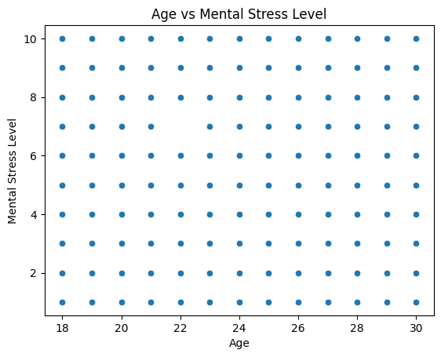

# Python Course - Final Assignment Requirements

## General requirements

* Suggestion (not mandatory requirement): everything should be in English.

* Select at least two different datasets, or three if you prefer more variety and practice, in which the target variable is:

  * a) a continuous, quantitative variable, to be used for regression.
  * b) a categorical variable to be used for classification, binary or multi-class.

Suggestion (not mandatory requirement): If the dataset is intended for multi-class classification, you may remove the target variable and use the same dataset for both Classification and Clustering algorithms. Read the dataset selection guidelines for more details on selecting a proper dataset.

* Implement at least the algorithms presented in the lectures in the three major categories of machine learning:

  * Regression: Multiple Linear Regression
  * Clustering: K-Means Clustering
  * Classification: KNN, Naive Bayes, Logistic Regression

* For each dataset:

  * describe and comment on the dataset,
  * explore visually,
  * describe statistically,
  * preprocess.

* For each algorithm:

  * train,
  * test,
  * fine tune hyperparameters,
  * implement variations with features' selection or hyperparameters,
  * evaluate on test set to select best model,
  * validate with predictions on new observations (do inference),

* If you implement more than two algorithms of any category:

  * compare the results,
  * pick a winner.

Alternatively, you may use a dataset from your work and implement only the algorithms that you consider to be relevant to that data. Accordingly, you may implement any other algorithms that you find more appropriate for you work related data instead of the ones presented in the lectures. That will be considered a plus.
**Make sure to explicitly mention this at the top of the notebook**.

---

## Grading Criteria for Structure and Content Requirements

### Submission Files

Mandatory: each category of algorithms must be implemented in a separate `.ipynb` notebook. Submit:

* Three interactive Python notebook files (`.ipynb`).
* The corresponding dataset files.

Mandatory: the submission should be a single `.zip` file.

Failure to meet these two requirements may result in submission rejection.

### Notebooks Mandatory Requirements

a) Mandatory file naming convention:

* Use **snake_case** format.
* The filename should include:
  * a **prefix** (your last name + _ + first letter of name, e.g., `argyriou_t`)  
  * a **suffix** indicating the algorithm type.  

Example, if your name is *Thanasis Argyriou*:  

* `argyriou_t_regression.ipynb`
* `argyriou_t_clustering.ipynb`
* `argyriou_t_classification.ipynb`

Failure to meet the files' naming convention results in submission rejection.

b) Suggested folders and files Structure (not mandatory requirement):

* All files must be in one main folder with two sub-folders,
* A sub-folder named `data` containing all dataset files,
* A sub-folder named `notebooks` containing the notebooks.
* Alternatively, you may put all files in the same folder.

c) Executability:

* Use working relative path to read data (Mandatory): Using an absolute path to read the data results in losing in total 1 points in each Notebook because it violates two criteria: "Notebook executability" and "Use of relative paths to load data". The notebooks must run without any path modifications on any PC that has the required libraries installed. This means that the data can be loaded by each notebook without moving files around after unzipping the files.

* Run all should produce no Errors (Mandatory): The notebooks must run without any errors. If you use proper relative paths, but you have any other code cell in the notebook that breaks the code run, this results in losing 0.5 points for the criterion "Notebook Executability".

d) Suggested Notebooks Structure and Readability:

* Structure (not mandatory requirement): notebooks should follow the **same structure**. Create a template for all three notebooks.
* Readability (mandatory requirement): Mandatory use of **Markdown cells** to clearly separate sections and provide comments, conclusions, and explanations. Using "code" cells for headers and conclusions, remarks results in losing 0.5 points for the criterion "Notebook Readability".

### Suggested Notebooks' Sections

The sections structure and names are not mandatory, but the submission should definitely include all of the following content:

1. Import Necessary Libraries
    * Use proper Python imports, no unused imports.
    * All imports should be at the top of the notebook.
    * No pip install in the notebook.

2. Load, Describe, Present the Data

   * Briefly verbally describe:
     * Data types (quantitative/categorical)  
     * Features & target variable

3. Exploratory Data Analysis (EDA)

This is a strict criterion, be careful:

   * Visualizations with appropriate graphs depending on features' data types.
   * Plots that are not appropriate, misleading or fall in the common plotting caveats categories like "spaghetti plots" or "overplotting" result in losing at least 0.5 points for the criterion "Proper Exploratory Data Analysis".   
  Examples of [Plotting Caveats](https://www.data-to-viz.com/caveats.html).  
  Example of an inappropriate plot:   
   
     

   * Add brief or detailed comments as needed  

4. Descriptive Statistics
   * Summary statistics
   * Correlations

5. Data Preprocessing
   * Convert data types if needed
   * Split into train/test set
   * Feature scaling, feature engineering, if needed

6. Algorithm Implementation

   * Train, Evaluate on test set, Fine-tune
   * Try different model hyperparameters, or try different features' selection as input. 
   For example, just using different number of clusters or just using different number of Neighbors in KNN is adequate. It is not mandatory to use a different algorithm, but  it is necessary to demonstrate model fine-tuning.
   In short: model fine-tuning is mandatory, implementation of different algorithms is optional.

7. Evaluate model efficiency using proper evaluation metrics depending on algorithm and use-case.
   * For Classification, implement all covered algorithms.

8. Model Selection
   * Compare models and select winning model, implementation.
   * Justify numerically and visually the winning model.
   * Explain model prediction efficiency (not speed).
   * For Classification, compare all algorithms and comment on the "winning model" selection.

9. Model Validation
   * Validate the model by conducting predictions on new hypothetical observation(s).
   * Briefly explain the prediction results.

 ---

## Grading Criteria and Rubric Information

### Grades criteria and weights within notebooks on a scale of 10

The following are the weights for a perfect 10 in a single notebook.
The suggested sections might not be the same as described here, but the content should be.

* Overall notebook executability: 0.5
* Notebook Readability: 0.5
* Proper python imports: 0.5
* Appropriate dataset selection: 0.5
* Use working relative paths to read data: 0.5
* Data Presentation: 0.5
* Proper Exploratory Data Analysis: 1.5
* Descriptive Statistics: 0.5
* Data Preprocessing: 1.0
* Model Implementation, Testing, Finetuning: 2.0
* Model evaluation with proper metrics: 1.0
* Model's Comparison and model Selection: 0.5
* Model Validation with new data: 0.5

Within notebook grades are first summed and then rounded to nearest 0.5 digit to calculate the notebook grade.

### Notebooks' weights on a scale of 10

* Regression notebook: 2.5
* Clustering notebook: 2.5
* Classification notebook: 5.0

If a notebook is not submitted, the weight of that notebook still counts towards the total assignment grade.

Notebook grades are first summed and then rounded to nearest 0.5 digit, in order to calculate the total assignment grade. Acceptable grades are from 5 to 10 with a step of 0.5: 5, 5.5, 6, 6.5, 7, 7.5. 8, 8.5. 9, 9.5. 10.

Hypothetical example:

* "Regression notebook" gets 8.5/10 points, which adds 8.5 * 0.25 = 2.125 points to the total assignment grade.
* "Clustering notebook" gets 8.0/10 points, which adds 8.0 * 0.25 = 2.0 points to the total assignment grade.
* "Classification notebook" gets 8.0/10 points, which adds 8.0 * 0.50 = 4.0 points to the total assignment grade.

Accordingly, the total assignment grade is 8.125/10 which is rounded to 8.0/10.
